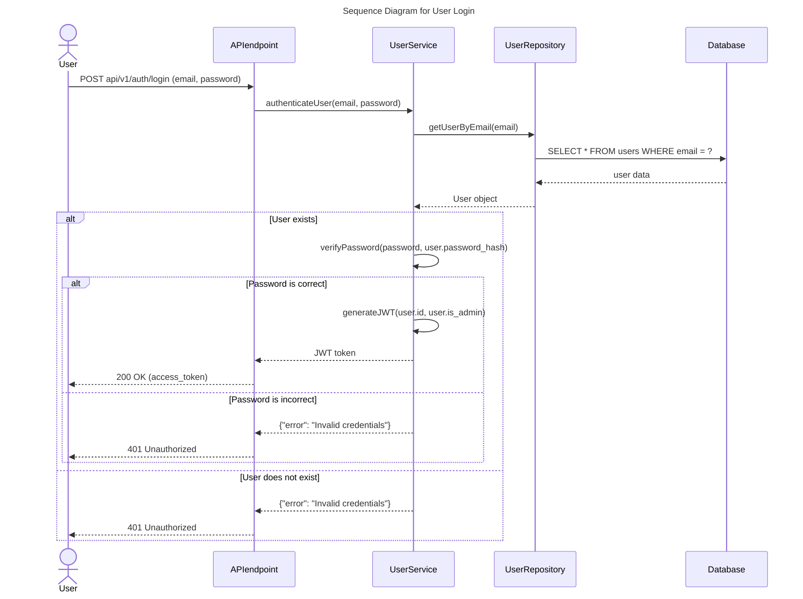

# HBnB 🏠

## Descripción

HBnB es una plataforma web inspirada en Airbnb, desarrollada completamente desde cero. Nuestro objetivo es ofrecer una experiencia fluida y funcional para la reserva y gestión de alojamientos.

## Objetivo 📌
El propósito de este proyecto fue construir desde cero, una aplicación web donde los usuarios puedan:

✅ Hacer Login
✅ Ver los alojamientos existentes 🏡  
✅ Filtrar hospedajes 🔍  
✅ Agregar Reviews ✍️  
✅ Ver las acomodaciones 🏨

## Cómo se ve la aplicación:

**Video** 🏠
[](https://youtu.be/g8apjaBVCFA)


## Flujo de secuencia



## Tecnologías Utilizadas 🛠️
Para lograr nuestro objetivo, utilizamos diversas herramientas y lenguajes, entre ellos:

- **Python** 🐍 (Back-end y gestión de datos)
- **Flask** 🌐 (Framework web)
- **JavaScript** 📜 (Interactividad en el front-end)
- **HTML y CSS** 🎨 (Interfaz de usuario)
- **SQLAlchemy** 🗃️ (ORM que facilita la interacción con bases de datos SQL)
- **SQLite** 💾 (Base de datos ligera y fácil de usar para desarrollo y pruebas)
- **GitHub** 🌍 (Control de versiones y colaboración)

## Instalación y Uso 🚀
Si deseas probar el proyecto en tu entorno local, sigue estos pasos:

1. **Clona el repositorio:**
   ```bash
   git clone git@github.com:tu-usuario/holbertonschool-hbnb.git
   cd holbertonschool-hbnb
   ```
2. **Instala las dependencias:**
   ```bash
   pip install -r requirements.txt
   ```
3. **Inicializa la base de datos:**
   ```bash
   flask shell
   >>> from app import db
   >>> db.create_all()
   >>> exit()
   ```
4. **Ejecuta el servidor:**
   ```bash
   python3 run.py
   ```
5. **Abre tu navegador y accede a:**
   ```
   http://localhost:5000...
   ```

## Mejoras en la Rama "mafe" 💪

En la rama mafe, encontrarás la carpeta mafe_part5, donde se han realizado optimizaciones adicionales al proyecto. Estas incluyen mejoras en la estructura del código, 
diseño y modularidad tanto en el frontend como en el backend.
---

✨ **¡Gracias por visitar nuestro proyecto HBnB! Esperamos que disfrutes explorándolo tanto como nosotros disfrutamos creándolo.** ✨

