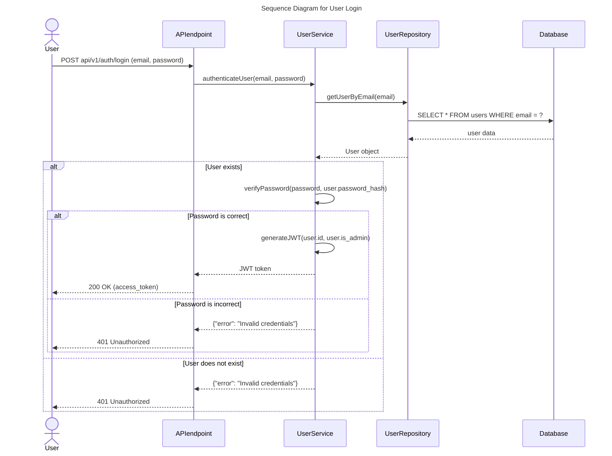

# HBnB 🏠

## Description

HBnB is a web platform inspired by Airbnb, built completely from scratch. Our goal is to offer a smooth and functional experience for booking and managing accommodations.

## Goal 📌
The purpose of this project was to build, from the ground up, a web application where users can:

✅ Log in
✅ View existing listings 🏡
✅ Filter accommodations 🔍
✅ Add reviews ✍️
✅ View accommodation details 🏨

## How the application looks:

**Video**🔗 [Ver video en YouTube](https://youtu.be/ibFUvtMqvnU?si=qWfZ68YNVFDQ3Y76)


## Sequence Flow



## Tech Stack 🛠️

- **Python** 🐍 (backend and data handling)

- **Flask** 🌐 (web framework)

- **JavaScript** 📜 (front-end interactivity)

- **HTML & CSS** 🎨 (user interface)

- **SQLAlchemy** 🗃️ (ORM for SQL databases)

- **SQLite** 💾 (lightweight database for development and testing)

- **GitHub** 🌍 (version control and collaboration)

## Installation & Usage 🚀
If you want to try the project locally, follow these steps:

1. **Clone the repository:**
   ```bash
   git clone git@github.com:tu-usuario/holbertonschool-hbnb.git
   cd holbertonschool-hbnb
   ```
2. **Install dependencies:**
   ```bash
   pip install -r requirements.txt
   ```
3. **Initialize the database:**
   ```bash
   flask shell
   >>> from app import db
   >>> db.create_all()
   >>> exit()
   ```
4. **Run the server**
   ```bash
   python3 run.py
   ```
5. **Open the UI preview**
   - VS Code: right-click `index.html` → **Open with Live Server** (recommended)
   > Note: If you don't see the option, install the “Live Server” extension in VS Code.

## Improvements in the "mafe" Branch 💪

In the mafe branch, you’ll find the mafe_part5 folder, where additional optimizations were made to the project. These include improvements to code structure, design, and modularity across both the frontend and backend.

---

✨ **Thanks for visiting our HBnB project! We hope you enjoy exploring it as much as we enjoyed building it.** ✨


