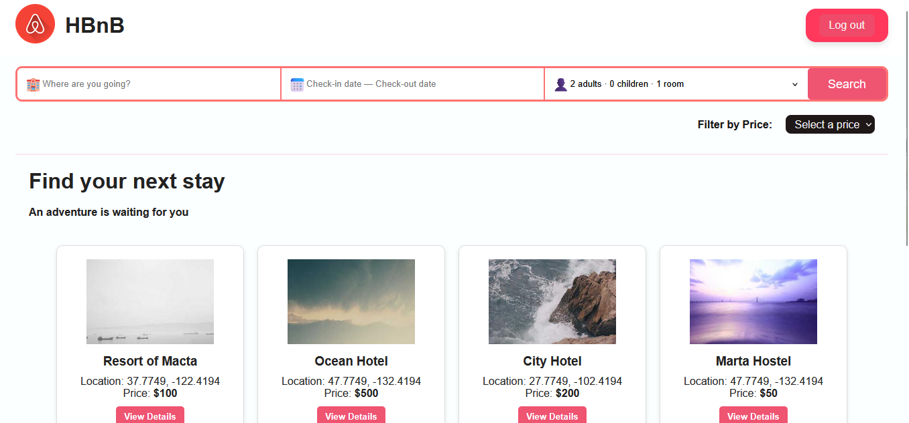

# HBnB – Part 5: Improvements & Optimization 🚀

## How it looks



## Description 📌

This mafe_part5 directory contains a series of improvements and optimizations made to the HBnB project.

## Goal 🏆
This phase focuses on optimizing the application at multiple levels:

✅ CSS design refinements 🎨
✅ Better organization and cleanup of HTML 📄
✅ Removal of unnecessary pages and consolidation for efficiency 🔄
✅ Responsiveness tweaks 📱
✅ Progressive backend optimization for improved modularity and scalability ⚙️
✅ Adoption of best practices across frontend and backend as I learn and iterate 📖✨

## Tech Stack 🛠️

- **HTML & CSS** 🎨 (visual structure and styles)

- **JavaScript** 📜 (interactivity improvements)

- **Python** 🐍 (backend optimization and modular structure)

- **Flask** 🌐 (web framework)

- **GitHub** 🌍 (version control and collaboration)

## How to Run 🚀
To see the changes in action, follow these steps:


1. **Go to the mafe_part5 directory:**
   ```bash
   cd mafe_part5
   ```

2. **Initialize the database:**
   ```bash
   python3
   >>> from app import db
   >>> db.create_all()
   >>> exit()
   ```
3. **Start the server::**
   ```bash
   python3 run.py
   ```
4. **Open the UI preview**
   - VS Code: right-click `index.html` → **Open with Live Server** (recommended)
   > Note: If you don't see the option, install the “Live Server” extension in VS Code.

---
✨ **I hope these improvements make the HBnB experience even better!** ✨

